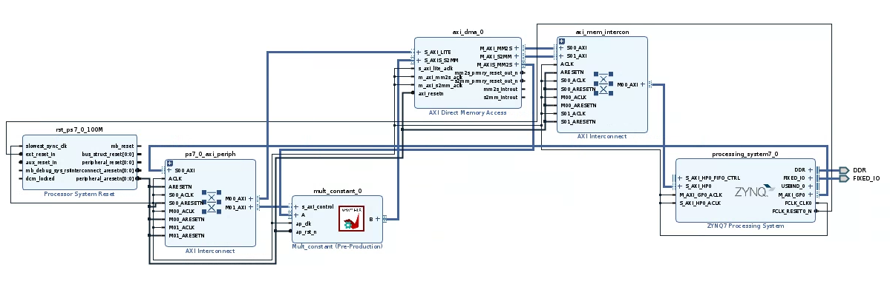
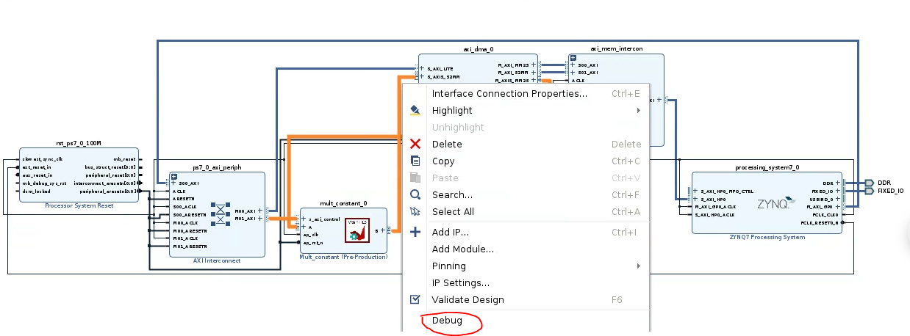
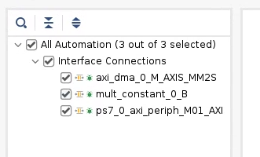
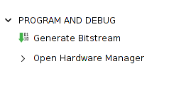
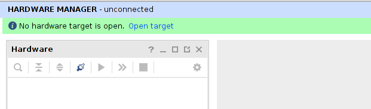
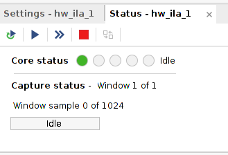
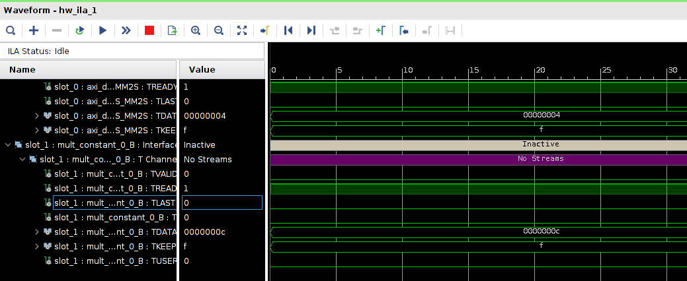
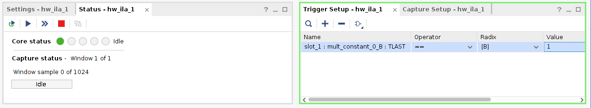
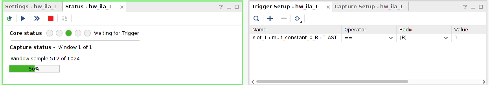
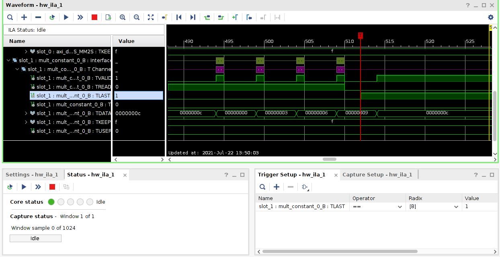

# Study Note 1: Use ILA to check HLS design
This notebook gives a brief idea about how to use the ILA to check the HLS design.

## Develop the diagram and add ILA
Here we use the multiply constant ip inspired by the [official overlay tutorials](https://pynq.readthedocs.io/en/latest/overlay_design_methodology/overlay_tutorial.html). The IP can be found in the ip folder.

The digram is shown below.

We can select whatever interface we want to monitor to debug.



The ILA would automatic added on the digram, the auto connection can be used for connect.
(Add a screenshot for the ILA)

Then generatre the bitstream and load the overlay to PYNQ board as usual.

## Run the IP


```python
from pynq import Overlay
from pynq import allocate
import numpy as np
```


```python
overlay = Overlay('./overlays/mult_constant.bit')
# overlay?
```


```python
dma = overlay.axi_dma_0
multiply = overlay.mult_constant_0
```


```python
multiply.register_map
```


    RegisterMap {
      constant_r = Register(constant_r=0)
    }


```python
in_buffer = allocate(shape=(5,), dtype=np.uint32)
out_buffer = allocate(shape=(5,), dtype=np.uint32)

for i in range(5):
    in_buffer[i] = i

multiply.register_map.constant_r = 3
dma.sendchannel.transfer(in_buffer)
dma.recvchannel.transfer(out_buffer)
dma.sendchannel.wait()
dma.recvchannel.wait()

print(out_buffer)
del in_buffer, out_buffer
```

    [ 0  3  6  9 12]
    

## Using ILA check the results

Make sure your USB cable is connected with in the computer you running VIVADO.
Open the Hardware Manager.
Select Open target. 
Click the triangle to run the process. 
Then you can see the waveform of the selected interface. 

## Using a single trigger to track the wave

You can also select a specific pin as trigger. In this example, we use TLAST in output as trigger. You can drag it from the Name window to the Trigger Setup window. I also change the value to 1, as the TLAST usually 0.



Click the triangle to run the process and we should fiond wait for trigger message.



Run the code again.


```python
in_buffer = allocate(shape=(5,), dtype=np.uint32)
out_buffer = allocate(shape=(5,), dtype=np.uint32)

for i in range(5):
    in_buffer[i] = i

multiply.register_map.constant_r = 3
dma.sendchannel.transfer(in_buffer)
dma.recvchannel.transfer(out_buffer)
dma.sendchannel.wait()
dma.recvchannel.wait()

print(out_buffer)
del in_buffer, out_buffer
```

    [ 0  3  6  9 12]
    

We can get the waveform before and after the trigger we select.



Done!
